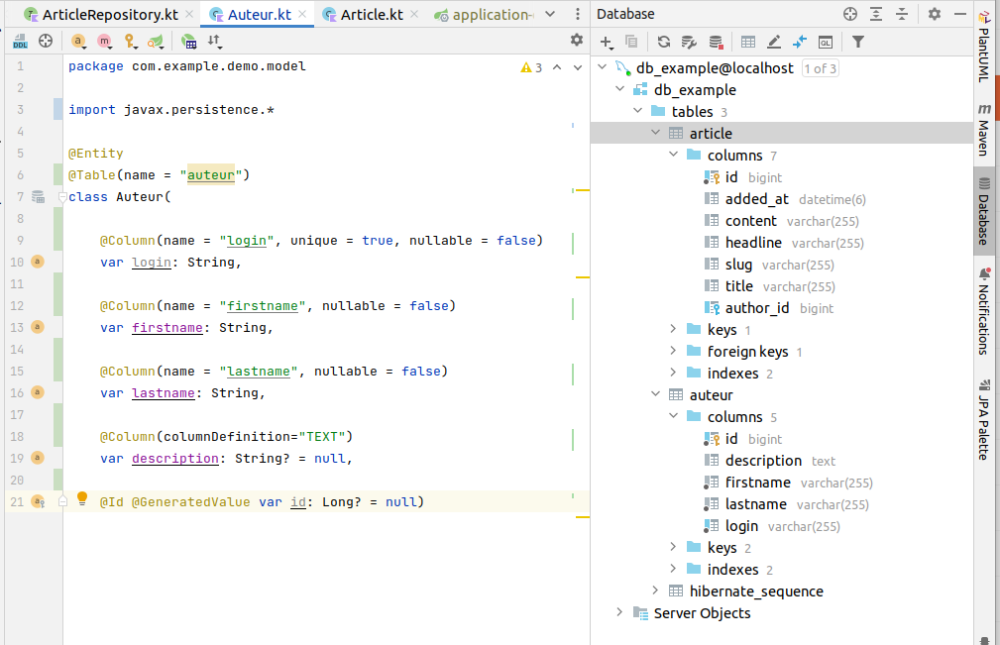

:toc:
:icons: font
:source-highlighter: prettify
:project_id: demo-spring-boot-kotlin-jpa
:tabsize: 2

= Application support

Une application starter basée sur les guides suivants

* https://spring.io/guides/tutorials/spring-boot-kotlin/
* https://spring.io/guides/gs/accessing-data-mysql/

Une lecture de ces ressources est vivement recommandée.

== Prérequis

* Premiers pas réussis en Kotlin
* Une machine opérationnelle (test de l'application https://github.com/ldv-melun/sbfirst)
* Avoir réalisé les exercices https://ldv-melun.github.io/sio-slam/sio-component/index-spring-boot.html#_travaux_pratiques_le_contr%C3%B4leur_et_la_vue_initiation[Exercices avec Controleur et Vue]
* Disposer d'un serveur Mysql à proximité (plus simplement sur votre machine de dev)

== Les dépendances

* Maven
* Spring Boot Starter
* Thymeleaf
* Mysql
* Webjars
* BootStrap

Basé sur le thème (qu'il faudra personnaliser) : https://getbootstrap.com/docs/5.2/examples/navbar-static/

== Avant de commencer

=== Initialiser la base de données en ligne de commande

Après avoir lancé la commande `mysql` (une application qui se connecte par défaut au serveur mysql de la machine), vous créez une base de données, qui sera exploitée par l'application, ainsi qu'un utilisateur `mysql`.

Dans un second temps, vous (en tant qu'administrateur de bases de données) donnez les droits à l'utilisateur sur la base de données de l'application.

[source, mysql]
----
mysql> create database db_example; -- Creates the new database
mysql> create user 'springuser'@'%' identified by 'ThePassword'; -- Creates the user
mysql> grant all on db_example.* to 'springuser'@'%'; -- Gives all privileges to the new user on the newly created database
----

=== À faire ultérieurement (sécurité)

En mode production, limiter les droits de l'utilisateur `mysql` sur la base de données de l'application.

[source, sql]
----
mysql> grant select, insert, delete, update on db_example.* to 'springuser'@'%';
----

Voir ici : https://spring.io/guides/gs/accessing-data-mysql/ chapitre, "_Make Some Security Changes_"

== Prise en main

Après avoir cloné l'application, et avant de lancer l'application, vérifier la conformité du contenu de `src/main/resources/application-local.properties`.

Prendre connaissance de l'impact `spring.jpa.hibernate.ddl-auto=*create-drop*` sur la base de données (puis changer par *update*), et, en particulier, consulter le corps de la méthode  `databaseInitializer()` de la classe `DatabaseInitializer`.

TIP: Le schéma de la base de données, ainsi que ses datas sont consultables directement dans l'IDE, via l'onglet `Database` de la Toolbar. 

== Le modèle

[source, kotlin]
----
@Entity <1>
@Table(name = "auteur")
class Auteur(

    @Column(name = "login", unique = true, nullable = false) <2>
    var login: String,

    @Column(name = "firstname", nullable = false)
    var firstname: String,

    @Column(name = "lastname", nullable = false)
    var lastname: String,

    @Column(columnDefinition="TEXT")
    var description: String? = null,

    @Id @GeneratedValue var id: Long? = null) <3>

@Entity
class Article(
    var title: String, <4>
    var headline: String,
    var content: String,
    @ManyToOne var author: Auteur,  <5>
    var slug: String = title.toSlug(),
    var addedAt: LocalDateTime = LocalDateTime.now(),
    @Id @GeneratedValue var id: Long? = null)

----
<1> Désigne cette classe comme Entité, c'est à dire en relation avec une table dans le système de persistance de type SQL
<2> Donne des informations pour la colonne correspondant à la propriété `login`
<3> Clé primaire
<4> Le nom de la colonne est directement déduit, par défaut, du nom de la propriété
<5> Une relation entre entités du modèle. Autre choix `ManyToMany`, `OneToMany`, `OneToOne`

== Le schéma relationnel

Exemple d'ordre SQL de création du schéma de la base de données (opération réalisée par Spring Boot / Hibernate)

[source, sql]
----

CREATE TABLE `auteur` (
  `id` bigint NOT NULL,
  `description` text,
  `firstname` varchar(255) NOT NULL,
  `lastname` varchar(255) NOT NULL,
  `login` varchar(255) NOT NULL,
  PRIMARY KEY (`id`),
  UNIQUE KEY `UK_3s24xk1o0x58fo2v9gwwvff9w` (`login`)
) ENGINE=InnoDB DEFAULT CHARSET=utf8mb4

CREATE TABLE `article` (
  `id` bigint NOT NULL,
  `added_at` datetime(6) DEFAULT NULL,
  `content` varchar(255) DEFAULT NULL,
  `headline` varchar(255) DEFAULT NULL,
  `slug` varchar(255) DEFAULT NULL,
  `title` varchar(255) DEFAULT NULL,
  `author_id` bigint DEFAULT NULL,
  PRIMARY KEY (`id`),
  KEY `FKenlp249onbxbxu9okxjyhlym7` (`author_id`),
  CONSTRAINT `FKenlp249onbxbxu9okxjyhlym7` FOREIGN KEY (`author_id`) REFERENCES `auteur` (`id`)
) ENGINE=InnoDB DEFAULT CHARSET=utf8mb4

----

== Les repositories

[source, kotlin]
----

interface ArticleRepository : CrudRepository<Article, Long> { <1>
    // ---------------------------------------------------------------
    // Version Native SQL (dépendance avec le schéma relationnel)
    // ---------------------------------------------------------------

    @Query(
        value = "SELECT * FROM article ORDER BY added_at DESC", nativeQuery = true <2>
    )
    fun findAllArticlesOrderByAddedAtDesc(): List<Article> <3>

    // ---------------------------------------------------------------
    // Version DSL by Spring Boot (ne dépend que du modèle)
    // ---------------------------------------------------------------

    fun findBySlug(slug: String): Article? <4>
    fun findAllByOrderByAddedAtDesc(): Iterable<Article> <5>
}

----
<1> Une interface qui hérite de `CrudRepository`. O précise la classe du mdoèle et le type de la clé primaire. Ainsi, Spring Boot sera en mesure d'*implémenter* automatiquement le code. Que de temps gagné pour le développeur !
<2> Exemple d'usage de SQL pour implémenter des méthodes d'accès aux données. Très pratique si l'on dispose déjà de requêtes SQL sophistiquées.
<3> Le nom de la méthode associée à la requête SQL
<4> Inutile ici de coder du SQL ! Spring Boot se chargera de le faire pour vous. Les méthode doivent respecter les conventions de nommages et le bon nom des propriétés pour que cela fonctionne.
<5> Equivalent à `findAllArticlesOrderByAddedAtDesc` déclarée en premier !

== Le contrôleur

[source, kotlin]
----
@Controller
class ArticleController @Autowired
   constructor(private val articleRepository: ArticleRepository){ <1>

    @GetMapping("/articles")
    fun index(model: Model): String {
        model["title"] = "Les articles"
        model["articles"] = articleRepository.findAllByOrderByAddedAtDesc().map { it.toDto() } <2>
        return "article/index" <3>
    }
}
----
<1> Injection du repository en tant que propriété de la classe contrôleur
<2> Appel tous les articles, et transformation de chacun d'eux en objet `ArticleDto` (_data transfert object_)
<3> Désigne le nom de la vue qui sera utilisée

== Travaux pratiques

* Modifier la barre de navigation afin de ne montrer que les commandes suivantes :  `Articles`, `Auteurs`, `À Propos`

* Faire en sorte que la liste des articles soit présentées par ordre FIFO.

* Sur la page d'index des articles, ajouter, à chacune des fiches article, un lien permettant à l'utilisateur de visualiser le détail de cet article (tous ses champs). Prévoir une nouvelle méthode contrôleur dans la classe `ArticleController`, et une vue associée. (le formatage de la date peut être réalisé en `thymleaf` avec la classe utilitaire `#temporals` - consulter la documentation sur le net - https://stackoverflow.com/questions/39860643/formatting-date-in-thymeleaf[stackoverflow])

* Faire en sorte que la commande `Auteurs` présente la liste des auteurs. Prévoir une nouvelle classe contrôleur, nommée `PersonController` et une nouvelle vue associée (à placer dans le bon dossier)

* Permettre à l'utilisateur de créer une personne auteur (via un lien dans la vue `Liste des auteurs`), et prévoir une nouvelle méthode dans `PersonController` qui renvoie à une vue formulaire. Attention, le login d'un utilisateur doit être unique (clé candidate). La soumission du formulaire de création se fera par la commande HTTP `POST`.

* (Optionnellement) Proposer à l'utilisateur de modifier les caractéristiques d'une personne.

